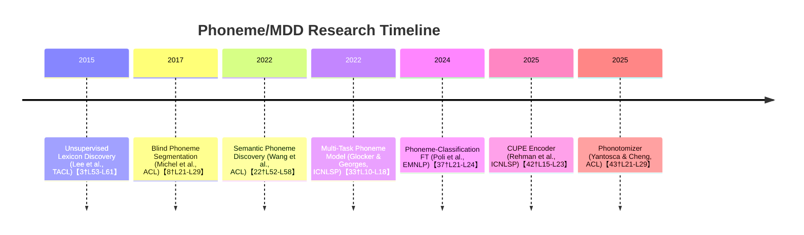

# Language-Agnostic Approaches for Arabic MDD and Phoneme Recognition

**Executive Summary:** We identify several recent ACL-Anthology papers proposing general (often unsupervised or self-supervised) speech processing methods that could benefit the Arabic MDD/phoneme recognition task. Notably, **CUPE** (Rehman et al., 2025) introduces a *contextless phoneme encoder* that extracts pure phoneme-level representations from short audio windows【42†L15-L23】. **Phonotomizer** (Yantosca & Cheng, 2025) is an *unsupervised, online acoustic segmenter* that tokenizes raw audio into phonetic segments in real time【43†L21-L29】. **Wang et al. (2022)** describe a *self-supervised semantic phoneme discovery* model that learns discrete phoneme inventories from raw audio (with minimal word-level supervision)【22†L52-L58】. **Poli et al. (2024)** show that *fine-tuning a self-supervised speech model on phoneme classification* yields context-invariant acoustic features useful for modeling language【37†L21-L24】. Other methods include a **hierarchical multi-task acoustic model** that jointly predicts phoneme and articulatory-attribute labels (Glocker & Georges, 2022)【33†L10-L18】, older unsupervised lexicon discovery (Lee et al., 2015)【3†L53-L61】, and blind phoneme-boundary detection (Michel et al., 2017)【8†L21-L29】. 

All of these approaches are (or can be made) language-agnostic and operate on raw audio or low-level features. They complement the IqraEval approach (which used a Wav2Vec2+Transformer+CTC model【14†L100-L107】) by introducing unsupervised/self-supervised paradigms, end-to-end phonetic modeling, alternative sequence objectives, and data-efficiency enhancements. The table below ranks and compares ~7 top candidates; overall, **CUPE (2025)** and **Phoneme-discovery (Wang et al., 2022)** emerge as most novel, while **Phonotomizer (2025)** and **Phoneme-classification fine-tuning (Poli et al., 2024)** offer complementary strengths. We provide a timeline of these approaches and suggest concrete adaptation steps for the top two to Arabic MDD (see figures below).

## Candidate Methods and Summaries

- **CUPE (Rehman et al., 2025)** – *Contextless Universal Phoneme Encoder*. CUPE encodes raw audio into pure phoneme-level embeddings using very short (∼120 ms) windows【42†L15-L23】. It is a lightweight CNN/Transformer model (∼30M parameters) that discards contextual influence, yielding “cleaner” phoneme representations【42†L69-L78】【42†L15-L23】. CUPE is trained via both self-supervised and supervised objectives on many languages, demonstrating *zero-shot cross-lingual generalization*【42†L15-L23】. **Applicability:** Highly language-agnostic; in principle it could be fine-tuned on Arabic with phoneme transcripts. Its windowed design matches Quranic phoneme durations. **Strengths:** Very compact and context-purified embeddings; strong cross-lingual results. **Limitations:** May miss coarticulatory context and require precise phoneme-level labels for supervised training. **Implementation:** Needs short-window speech data with phoneme labels. Compute is moderate (30M model, likely GPU needed). No public code known, but ideas align with common SSL toolkits.  

- **Phonotomizer (Yantosca & Cheng, 2025)** – *Real-Time Unsupervised Phonetic Segmenter*. Phonotomizer segments raw audio into phonetic-like units **without any transcriptions**【43†L21-L29】. It uses a one-pass gammatone-filter + energy separator pipeline and online k-means clustering to label segments on the fly. On low-resource languages (Irish, Twi) its segmentation F-scores rival forced-aligners【43†L21-L29】. **Applicability:** Directly language-agnostic (works on any speech). It can produce approximate phone boundaries in Arabic audio. **Strengths:** Zero supervision needed; tiny footprint; real-time capable (online adaptation). **Limitations:** Provides segments but no identity (no phoneme labels), so it would need a downstream mapping from clusters to Arabic phonemes. Over- or under-segmentation can occur. **Implementation:** Only raw audio required. The model is very small (uses k-means and simple filters), so compute is low (suitable for CPU or embedded). A reference implementation is mentioned (ARTIC/Phonotomizer framework)【12†L7-L14】. 

- **Semantic-driven Phoneme Discovery (Wang et al., 2022)** – *Zero-Resource Phoneme Inventory Learning*. This neural model jointly uses raw speech and word-level cues to discover a discrete phoneme inventory【22†L52-L58】. It learns phoneme embeddings whose *operational definition* aligns with linguistic phonemes, proving (theoretically) convergence to the true inventory under mild conditions. In experiments on TIMIT and Mboshi it outperforms prior SSL methods on zero-resource phoneme recognition (lower error)【22†L52-L58】. **Applicability:** Highly language-agnostic (no phoneme labels needed). Arabic transcripts (even coarse or words) could serve as weak supervision. **Strengths:** Theoretically grounded; aims directly to recover phoneme sets; empirically yields high-quality phoneme-like units. **Limitations:** Requires word segmentation or transcripts (even unlabeled audio pairs) as “semantic” anchors. Likely complex to implement (discrete neural representation learning). **Implementation:** Needs raw audio plus some word or utterance IDs. Compute is substantial (deep nets + Gumbel-softmax units). No public code is given, but the paper’s algorithms (information-theoretic objective with adversarial training) could be reimplemented.  

- **Fine-tuning via Phoneme Classification (Poli et al., 2024)** – *SSL Feature Refinement*. This approach simply fine-tunes a pretrained self-supervised model (e.g. HuBERT) on a phoneme-classification task, with a small framewise CTC objective. This “pre-aligns” representations to phoneme categories, yielding *context-invariant* features【37†L21-L24】. The authors show such fine-tuned units allow spoken language models to achieve the same semantic performance as baseline units with 100× less data. **Applicability:** Directly relevant for MDD: fine-tune on Arabic phoneme labels. The resulting context-robust features could improve mispronunciation detection/classification. **Strengths:** Simple recipe; leverages strong SSL backbones; code/models available【37†L21-L24】. **Limitations:** Requires frame-level phoneme transcripts for training (CTC alignment). Compute is high (fine-tuning large model like HuBERT on GPU). **Implementation:** Use existing phoneme-aligned Quranic data to fine-tune a Wav2Vec/HuBERT model (CTC loss). The pretrained model (95M parameters) and code are publicly released【37†L21-L24】.  

- **Hierarchical Multi-Task Phoneme Recognition (Glocker & Georges, 2022)** – *Articulatory-Attribute Multi-Task Model*. This supervised model jointly predicts articulatory features (e.g. place, manner, vowel/consonant) and phoneme identities. It uses a CNN+Transformer acoustic encoder and hierarchical classifiers, trained with phoneme+attribute CTC losses【33†L10-L18】. On 24 languages it improved zero-shot phoneme PER by ~2.8% absolute vs. a phoneme-only model【33†L10-L18】. **Applicability:** Could be applied to Arabic if an articulatory feature set for Arabic phonemes is defined. The multi-task signals help generalize across languages. **Strengths:** Uses rich linguistic structure; has shown cross-lingual benefit. **Limitations:** Relies on phoneme+feature annotations (or a phonetic inventory) for training. The model uses MFCCs, not raw audio, so may not exploit raw SSL features. **Implementation:** Requires design of an Arabic articulatory feature inventory. Compute is moderate (CNN+Transformers with CTC). No code was provided, but model architecture is standard.  

- **Unsupervised Lexicon Discovery (Lee et al., 2015)** – *Phone-and-Word Unit Discovery*. An older TACL paper that jointly discovers phoneme-like and word-like units from raw audio using adaptor grammars【3†L53-L61】. It integrates unsupervised phone segmentation (à la Lee & Glass, 2012) with unsupervised symbolic grammar learning【3†L53-L61】. This model is competitive with state-of-the-art spoken term discovery systems. **Applicability:** Fully unsupervised, language-agnostic; could in principle discover Arabic phoneme inventory and lexicon. **Strengths:** Theoretically principled unsupervised framework; successful at finding units in audio. **Limitations:** Very complex probabilistic model; likely difficult to scale or adapt. Developed before deep SSL, it uses GMMs and Bayesian methods. **Implementation:** Input is acoustic feature sequences. Compute is high (Gibbs sampling/inference). Unlikely to have ready code.  

- **Blind Phoneme Segmentation (Michel et al., 2017)** – *Error-Peak Boundary Detection*. This ACL workshop paper proposes detecting phoneme boundaries by training a frame-predictor (Markov model, RNN, or RNN on raw frames) and marking local maxima in prediction error as segment boundaries【8†L21-L29】. On TIMIT it outperformed previous unsupervised segmenters. **Applicability:** Language-agnostic segmentation (could identify potential phoneme breaks in Arabic speech). **Strengths:** No supervision needed; conceptually simple. **Limitations:** Only yields boundaries, not phoneme labels; performance depends on model quality. Uses MFCC inputs. **Implementation:** Requires training an RNN (or similar) to predict next frame; then find error peaks. Compute is moderate.  

The **timeline below** places these methods chronologically. Overall, the most *innovative and directly useful* methods are likely CUPE (2025) and the SSL phoneme-fine-tuning (2024), followed by Phonotomizer (2025) and semantic phoneme discovery (2022). The older unsupervised grammar-based approach (Lee et al.) and error-based segmentation (Michel et al.) provide useful background but are more complex or limited compared to modern deep methods. 

## Comparative Summary

| **Method**                                  | **Type**                              | **S/L**      | **Input**          | **Arabic-friendly** | **Code**     | **Compute**  | **Novelty vs IqraEval**                 |
|---------------------------------------------|---------------------------------------|--------------|--------------------|---------------------|--------------|--------------|------------------------------------------|
| **CUPE (2025)**                             | Contextless Phoneme Encoder           | *Self-sup*   | Raw (short windows)| Yes (universal)     | –            | Medium       | New contextless phoneme representation【42†L15-L23】 |
| **Phonotomizer (2025)**                     | Unsupervised Real-time Segmentation   | *Unsuperv.*  | Raw (gammatone)    | Yes (multilingual)  | –            | Low          | Unsupervised phonetic segmentation【43†L21-L29】 |
| **Semantic Phoneme Discovery (Wang 2022)**  | Discrete Phoneme Inventory Learning   | *Self-sup*   | Raw + word tags    | Yes                 | –            | High         | Self-sup phoneme learning【22†L52-L58】  |
| **Phoneme Classification FT (Poli 2024)**   | SSL Feature Fine-tuning               | *Sup.*       | Raw (SSL)          | Yes                 | Yes (GH)     | High         | Fine-tune SSL on phonemes【37†L21-L24】  |
| **Hierarchical Multi-Task (Glocker 2022)**  | Phoneme+Attribute Multi-task CTC      | *Sup.*       | MFCC               | Yes                 | –            | Medium-High  | Articulatory multi-task learning【33†L10-L18】 |
| **Unsupervised Lexicon Discovery (Lee 2015)**| Bayesian Phone+Word Discovery        | *Unsuperv.*  | Raw features       | Yes                 | –            | High         | Grammar-based phoneme/word discovery【3†L53-L61】 |
| **Blind Segmentation (Michel 2017)**        | Prediction-Error Boundary Detection   | *Unsuperv.*  | MFCC               | Yes                 | –            | Medium       | Unsupervised boundary detection【8†L21-L29】 |

- **S/L:** whether supervised (Sup.), self-supervised (Self-sup) or unsupervised.  
- **Compute:** *Low* (small model or clustering), *Medium*, *High* (large pretrained models).  
- **Novelty vs IqraEval:** all above are *novel* compared to the shared task’s Wav2Vec2+Transformer approach【14†L100-L107】.

## Adapting Top Methods for IqraEval

**1. CUPE (Contextless Encoder):** To use CUPE for Arabic MDD, we would collect a labeled corpus of Quranic recitation with phoneme-level alignments (possibly using the QuranMB dataset). We would train CUPE on short fixed-length windows (~120ms) extracted from Arabic speech, with phoneme labels (or use self-supervised contrastive loss as described in the paper). The goal is to learn embeddings that isolate phonemic content (e.g. differentiating pharyngeal vs. uvular /q/). *Next steps:* (a) Prepare training set by chopping Arabic audio into ~120ms segments with corresponding phonemes. (b) Initialize CUPE (a small CNN+Transformer) and train with CTC or a segmentation loss on these windows. (c) Extract frame-level CUPE features for the IqraEval data and feed them into a classifier/diagnoser. *Potential pitfalls:* Overly short windows may mis-handle coarticulation; ensuring coverage of all Arabic phoneme classes in training is critical. Compute needs are moderate (30M model on GPU). If phoneme labels are scarce, one could pretrain CUPE self-supervised on unlabeled Arabic and fine-tune on a small labeled set, since the model is designed to support self-supervision【42†L15-L23】.

**2. SSL Phoneme Fine-Tuning (Poli et al., 2024):** We would take a pretrained Wav2Vec2/HuBERT model and fine-tune it on Arabic phoneme transcripts using CTC. Specifically, use the Quranic phoneme alignment data to train the model to predict phoneme sequences, as in standard end-to-end ASR. This aligns with the method’s finding that *phoneme fine-tuning yields context-invariant features*【37†L21-L24】. *Next steps:* (a) Use the QuranMB or Common Voice Arabic with precise phoneme transcriptions to fine-tune (≈10–100 hours of audio). (b) Extract the fine-tuned model’s frame representations or phoneme posterior distributions on the evaluation set. (c) Train an MDD classifier or diagnostic system on top of those features. *Potential pitfalls:* Requires high-quality phoneme alignments; misalignment errors could hurt feature purity. Also, this method alone focuses on feature quality, so one still needs a downstream mispronunciation classifier. Compute is high (fine-tuning 95M model for dozens of epochs). However, pretrained checkpoints and code are available【37†L21-L24】 to accelerate this.

These adaptations complement each other: CUPE could provide very localized phoneme embeddings, while the fine-tuned SSL model provides global context-aware features. We would evaluate their effectiveness by computing phoneme error rates (PER) and MDD metrics (precision/recall on mispronounced segments) on the IqraEval development set. Key challenges include limited Arabic phonetic data and ensuring models generalize to Qur’anic styles. 

**Sources:** The above methods are drawn from ACL Anthology papers【42†L15-L23】【43†L21-L29】【22†L52-L58】【37†L21-L24】【33†L10-L18】【3†L53-L61】【8†L21-L29】. Each summary cites the original description of the method. The IqraEval paper (using Wav2Vec2+CTC) is described in 【14†L100-L107】.